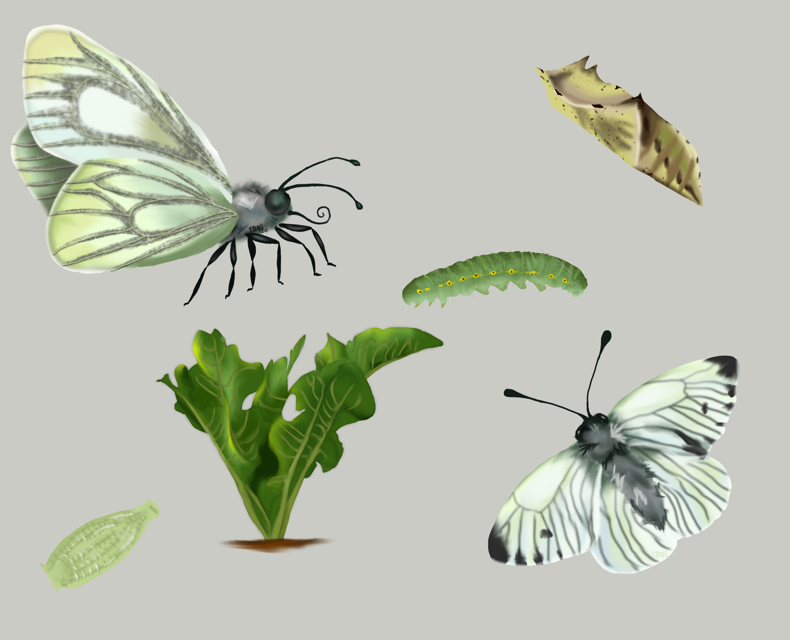

A space for some of my more creative endeavours, both with regards to communicating science but also (and possibly more importantly) just because 😊

  
  
Sometimes it's fun to break the mould a bit and see what the muse 'duct tapes'. Done in Photoshop CC

  
  
A Bateleur (*Terathopius ecaudatus*). A surprisingly colourful eagle and possibly one of my favourites. These guys are very easy to identify in flight - due to their short tails you can usually see their feet sticking out. Done on Photoshop CC

  
  
Squaring off with a leopard (*Panthera padrus*). Might have add some more portraits of big cats at some point... Done in Photoshop CC

  
  
Knysna Turaco (*Tauraco corythaix*) a endemic to South Africa and part of the funky Musophaginae family, which translates to banana eaters. Done on Photoshop CC

  
  
A collection of illustrations used for presenting research surrounding the thermal performance in butterflies. Done on Photoshop CC

