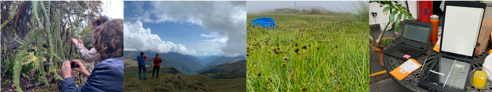
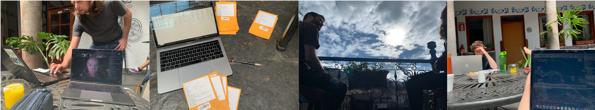

At the beginning of this course the thought of me sharing my experiences and being a (somewhat) active member of the science community on ‘The Twitter’ never crossed my mind. Yet, after my (unexpectedly) extended stay in Peru for the PFTC 5 course I think I’m getting the hang of this tweeting thing and it might be here to stay…

I think it’s fair to say that a reoccurring theme with this course was the unexpected and far reaching consequences of the COVID-19 pandemic. Not only did we have some direct changes to our actual trip and travel itinerary (with some of us leaving early and others having an extended stay), COVID-19 also changed my view of science and showed me the importance of the connections and networks of the scientific community. Essentially (at least to me now) science is more than just doing cool research and getting published, it’s about sharing your data and findings and working in a collaborative environment. I’ve never had to share my code with anyone (and my coding etiquette reflects that) and now I just want to or need to share everything (after extensive revisions of course). In addition, although I’m no longer having my three-hour breakfasts, I do still make an effort to check what is happening on #ScienceTwitter during this time and who knows maybe one day I’ll start tweeting about my own research and not just #Quarantrait or #COVID19refugee life.

I guess what I’m getting at is that although my main goals for this course were ‘science’ related – and don’t get me wrong I did learn a lot about the science side of things – I think I stepped away from this course with a much better understanding of both the ‘real’ science behind functional traits along with a better understanding of what it is like doing science in a collaborative world. So as much as the COVID-19 pandemic got in the way of us doing the science we had originally set out to do (but we did make the best of a less than ideal situation) I would dare to say that we (or at least I) still stepped away from this course with an unexpected but comprehensive learning experience. I would even go so far as to speculate that the networks we established during this course may be stronger than those of previous courses given our shared experiences through this pandemic – be it virtual or together in the courtyard of the Royal Inka I. Let’s just say I am very keen to see how far these relationships and collaborative efforts will go!

{.external width=100%} 

Before starting this course, we were asked to set some personal goals, so I guess it’s only fair to take a moment to reflect on them – funnily enough these were very much focused on the ‘real’ science side of things! I had previously told myself that I would consider this course a success if I walked away from this course being more confident in linking functional traits to broader ecosystem processes (and would be confident in applying the knowledge to my own research) and also having applied myself (read: being slightly less disorganised) by assisting in the administrative side of things such as the writing of data documentation and being part of the data curation process. I think given the circumstances we did a pretty good job of helping me realise my goals – especially on the data curation side of things. Also, I did mention that I was looking forward to making a new host of international friends and that can definitely be ticked off!

{.external width=100%} 

I guess it only fair to finish this post up with a bit of personal reflection upon having society and the world you know being flipped upside down by a pandemic. Spending 17 days in a government enforced lockdown means there is a lot of time for self-reflection and maybe just a hint of soul searching. Personally, I don’t think I was that perturbed by my new (and restricted) living conditions although a think that might be my ‘distance from the equator’ theory at play there (which might need to get its own blog post at some point…). Well that or I am really good at compartmentalising problems and keeping myself oblivious to things… I find that I managed to keep going on with ‘business as usual’ and think I may have actually been more productive!  Especially now in the second phase of my global pandemic journey where I’ve taken on refugee-like status with family friends in the UK countryside. Also, funnily enough, as disorganised and scatter-brained as I might be at times, I did find that I do need to have some structure and control in my life – in this case taking control of our morning Zoom meetings!

So, I think as much of a disturbance (annoyance) the COVID-19 pandemic has been both with regards to disrupting the original course plan and keeping me from getting home I think there are many positives that come from this as well. We still managed to get the teaching done and I’ve gained new insights to the (important) social side of science all while making some (hopefully) long-lasting connections. And lastly - as well as the most important I am going to be able to put proficient in Zoom on my CV. Who knows in the new post COVID-19 world it might be a highly sought-after skill!

See you guys on ‘The Twitter’

Cheers,

Tanya

