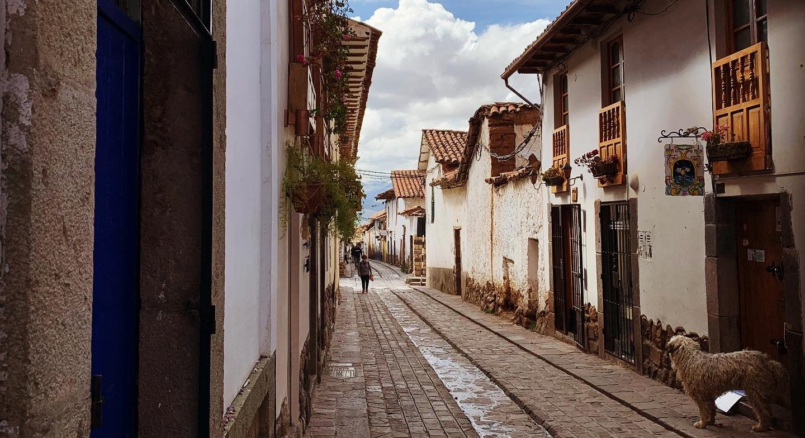

*“Could you pass the tomato sauce?”*

*“The what?!?”*

*“The tomato sauce.”*

*“Oh, you mean the ketchup!”*

*“Yeah that”*

Just a typical conversation at the dinner table between the many international students attending the fifth plant functional traits course in Perú co-hosted by the University of Bergen and Arizona. Most of our conversations are punctuated by local colloquialisms and some even take on a bilingual flair (“How would you say that in insert language?” or “We would say it like this in insert language.”). However, these idiosyncrasies are not only limited to our everyday conversations and our discussions revolving around science often have many diverse takes. 

Fast forward and the COVID-19 pandemic has wreaked havoc on global transportation networks. With Perú being one of the countries to declare a state of emergency and closing all borders and internal travel resulting in half of us being stranded. The awesome multinational cast of researchers that we are means that we’re now faced with a bit of a conundrum. We all belong to different institutions and countries – with many of us not even studying in our home country. Who do we belong to? Who is responsible for helping us get home? 

Well, I can tell you this, a residence permit only means so much – and support from your home institution? Don’t put too much stake on that! Having dual citizenship myself, and living in a third country while doing my Masters you’d think I’d have many avenues to pursue to try and get out. Well, the country I currently live (and have residence) in simply turned me away and my home country was of no assistance. The only light at the end of the tunnel – my second nationality – a country that I’ve never even lived in! Many of us were in the same boat, with most institutions dragging their feet to give any support (although a special shout out to the guys at Bergen) and having to just wait it out until our different governments could (hopefully) help us out.

{.external width=100%} 

Now, one could argue that we put ourselves in this situation. Going off to a developing country in what appears to be an emerging pandemic only to go out and ‘mess-around’ in the mountains in the name of science. But it’s so much more than that. As much as I was looking forward to learning about the science side of things the part of the course that I found the most attractive was the chance to meet so many international researchers. Science is after all a social activity and, with the ease of long-distance communication, collaborative projects can often span the globe. So, in reality this course is but a snapshot of what science looks like and how things work and working abroad is not uncommon. So, the question is should we stop trying to be globe trotters and just keep it local? Return back to a time when it was ‘us’ vs. ‘them’? Should we just dismantle the global science community?

Maybe it’s time that institutions actually take some responsibility for their employees. After all, we oftentimes uproot our whole lives to work with them, the least they could do is have our backs in times of crisis. We shouldn’t have to rely on the ‘back-up’ support from consulates and embassies – our institutions should be fighting for us too! I think if we were to ‘localise’ our science within country and institutional borders in fear of unknown disasters we would only be hamstringing that which we hold dear. We would be losing out on input of researchers from different cultural and sociological backgrounds and ultimately their unique take on that which we call science. In addition, localising science would mean missing out on ~~heated~~ extensive conversations regarding the correct pronunciation of words – I’m looking at you Americans! 😉

Cheers,

Tanya

