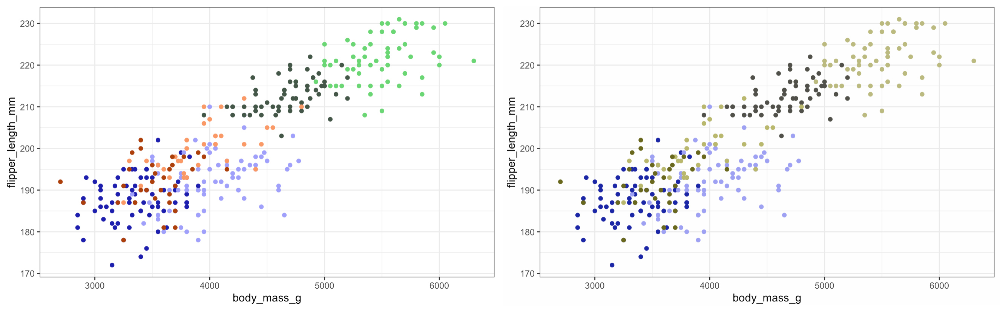
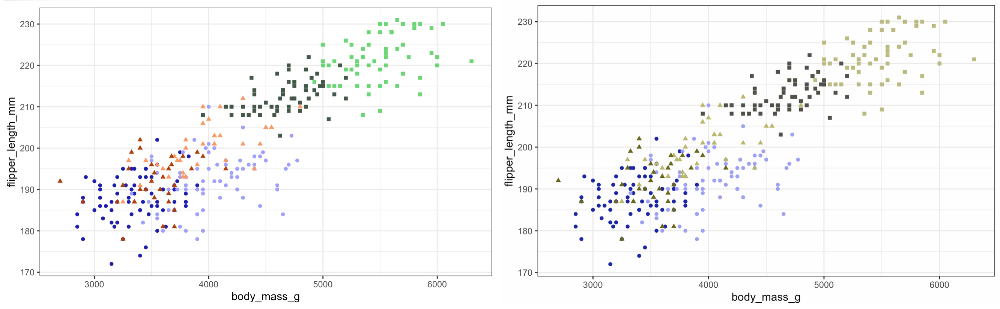
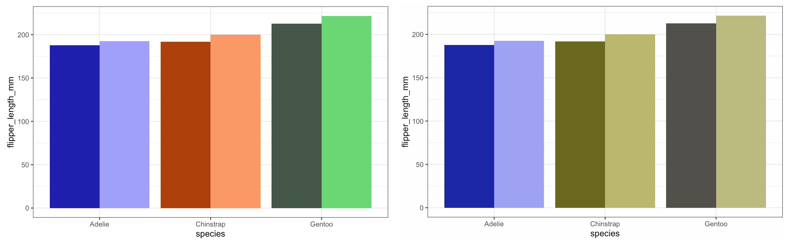
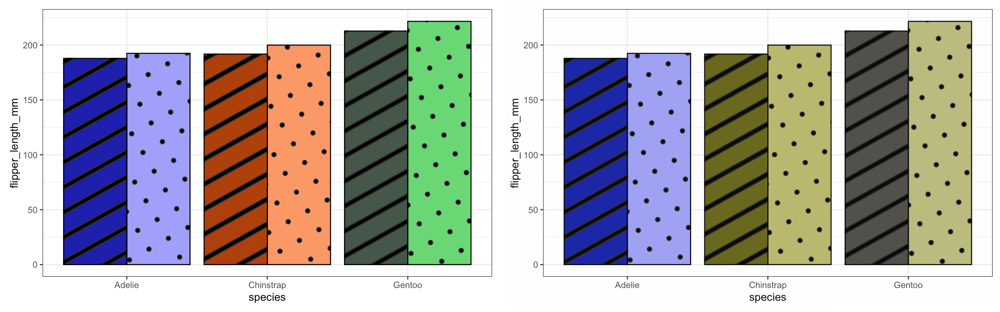

<div style="text-align: justify">
```{r setup, include=FALSE}
#knitr::opts_chunk$set(echo = FALSE)
#to install ggpattern and palmer penguins
#remotes::install_github("coolbutuseless/ggpattern")
#remotes::install_github("allisonhorst/palmerpenguins")
library(ggpattern)
library(palmerpenguins)
library(ggplot2)
library(fontawesome)
```

On my 'over breakfast' Twitter scroll I cam across [this](https://blog.datawrapper.de/colorblindness-part1/) interesting series of blogposts on the Chartable blog (hosted by Datawrapper) that discusses how we can make our plots and visuals more friendly for colourblind and colourweak readers. They raised some intersting points and options to use and I thought it would be a 'constructive' way to spend my Friday trying to impliment these ideas in R, specifically using `ggplot2`.

In the [second](https://blog.datawrapper.de/colorblindness-part2/) blogpost they have a long discussion about different ways to make your figures more inclusive (I highly reccomend reading the full article - it has some awesome visuals as well) and along with the standard reccomendation to **avoid green** and trying to go with **complimentary colours such as blue and orange** some other points they raised taht I thought were intersting include:

* **Playing with the lightness of your colours**
  + Even if you end up using non-ideal colours you can use darker and lighter shades to offset the similarity
* **Using fewer colours**
  + Maybe only use colour to highlight differences or pull out the main points of the figure
* **Play with shapes and patterns**
  + This can include using symbols (such as ticks and crosses) to imphasise a point or show different groups in scatterplots, or use patterns for line plots or even for fill colours on geom-type plots

So at first glance most of these options seem very do-able and easy to intergrate into the `ggplot2` workflow, with the exception of specifying patterns for fills of geom objects (think barplots) but I came across the `ggpattern` package which solves that problem with what seems to be a huge degree of cutomisability - see the package website [here](https://coolbutuseless.github.io/package/ggpattern/). At time of writing this package isn't available on CRAN yet but can be downloaded and installed via GitHub.

With that out of the way let's get to the actual plotting. Also I thought this would be a good opportunity to play with the `penguins` dataset that was [recently released](https://towardsdatascience.com/penguins-dataset-overview-iris-alternative-9453bb8c8d95) as an `iris` alternative.

# Playing with lightness

This is theoretically a very simple example to execute as we can just specify our colour choices to be of varying shades. For this example I decided to plot body mass vs. flipper length for the different penguin species as well as for males and females. I used [Adobe Color][https://color.adobe.com/create/color-wheel] to pic my colours but thats just personal preference.

```{r lightness, echo=TRUE, warning=FALSE}

library(ggplot2)
library(dplyr)
library(palmerpenguins)

#import data
penguins <- penguins %>%
  #removing NAs for ease
  na.omit()

#specify colours manually
AdeMale <- "#1C1DAD"
AdeFem <- "#A0A0FA"
ChiMale <- "#AD400B"
ChiFem <- "#FA9966"
GenMale <- "#445748"
GenFem <- "#6AD674"

#create plot
P1 <- ggplot() +
  geom_point(data = penguins,
             aes(x = body_mass_g,
                 y = flipper_length_mm,
                 #make new grouping variable with the species sex combos
                 colour = paste(penguins$species,
                                penguins$sex)),
             #for simplicity removing legend
             show.legend = FALSE) +
  #set colours
  scale_colour_manual(values = c(AdeMale,
                                 AdeFem,
                                 ChiMale,
                                 ChiFem,
                                 GenMale,
                                 GenFem)) +
  theme_bw()

```

{.external width=100%} 

So we can see that using the different shades of the same colour for the different sexes works really well - although arguably there is some issue distinguishing between the species so lets add some shapes...

# Adding shapes

```{r shapes, echo=TRUE, warning=FALSE}

P2 <- ggplot() +
  geom_point(data = penguins,
             aes(x = body_mass_g,
                 y = flipper_length_mm,
                 #make new grouping variable with the species sex combos
                 colour = paste(penguins$species,
                                penguins$sex),
                 #specify grouping var for shape
                 shape = species),
             #for simplicity removing legend
             show.legend = FALSE) +
  #set colours
  scale_colour_manual(values = c(AdeMale,
                                 AdeFem,
                                 ChiMale,
                                 ChiFem,
                                 GenMale,
                                 GenFem)) +
  theme_bw()

```

{.external width=100%} 

**Nice!** As we can see just adding one line to our code can make all the difference.

# Playing with patterns

This is where it gets fun - time to play with a new package. If we want to call patterns for our geoms instead of using the standard `geom_*` function from `ggplot2` we will be using the `geom_*_pattern` function from the `ggpattern` package. But first we can have a look at our original colour palette using a standard boxplot - let's stick to flipper length.

```{r col, echo=FALSE, warning=FALSE}
#To download package from GitHub
#remotes::install_github("coolbutuseless/ggpattern")
penguins_summary <-
  penguins %>%
  group_by(species, sex) %>%
  summarise_at(vars(flipper_length_mm),
               mean)

P3 <- ggplot() +
  geom_col(data = penguins_summary,
             aes(y = flipper_length_mm,
                 x = species,
                 group = sex,
                 #make new grouping variable with the species sex combos
                 fill = paste(penguins_summary$species,
                                penguins_summary$sex)),
             #for simplicity removing legend
             show.legend = FALSE,
           position = "dodge") +
  #set colours
  scale_fill_manual(values = c(AdeMale,
                                 AdeFem,
                                 ChiMale,
                                 ChiFem,
                                 GenMale,
                                 GenFem)) +
  theme_bw()

```

{.external width=100%} 

Here we can see how the different shades pop out really nicely - arguably we can still distinguis between the Chinstraps and the Gentoos but I think we can play with the aesthetics a bit more and make the plot pretty - not just functional!

```{r pattern, echo=TRUE, warning=FALSE}
#To download package from GitHub
#remotes::install_github("coolbutuseless/ggpattern")
library(ggpattern)

#Summarised the dataset for plotting

P4 <- ggplot() +
  geom_col_pattern(data = penguins_summary,
                   aes(y = flipper_length_mm,
                       x = species,
                       group = sex,
                       #make new grouping variable with the species sex combos
                       fill = paste(penguins_summary$species,
                                    penguins_summary$sex),
                       #specify pattern type
                       pattern = sex),
                   #specify the fill for the pattern
                   pattern_fill = "black",
                   #specify box colour
                   colour  = 'black',
                   #for simplicity removing legend
                   show.legend = FALSE,
                   position = "dodge") +
  #set colours
  scale_fill_manual(values = c(AdeMale,
                               AdeFem,
                               ChiMale,
                               ChiFem,
                               GenMale,
                               GenFem)) +
  theme_bw()

```

{.external width=100%} 

**Neat!** We can see that the patterns add a new 'level' to our plots and if you look at the syntax of the ggpatterns functions we see that it mirrors that of ggplot - it just has a few more `_pattern` thrown in! This package allows a large degree of freedom with regrads to what and how you want your patterns to look like. You can even import images or make your own patterns. Combine this with the somewhat intuitive syntax (if you're comfortable with ggplot) it is something I can see myself trying to use more often when making figures.

Cheers

Tanya

</div>

## Footnote {.appendix}
If you want a better look at all of the code feel free to have a peek on GitHub [`r fa("github")`](https://github.com/TanyaS08/TanyaDoesScience/blob/master/_posts/2020-06-14-data-visualisation/data-visualisation.Rmd)
