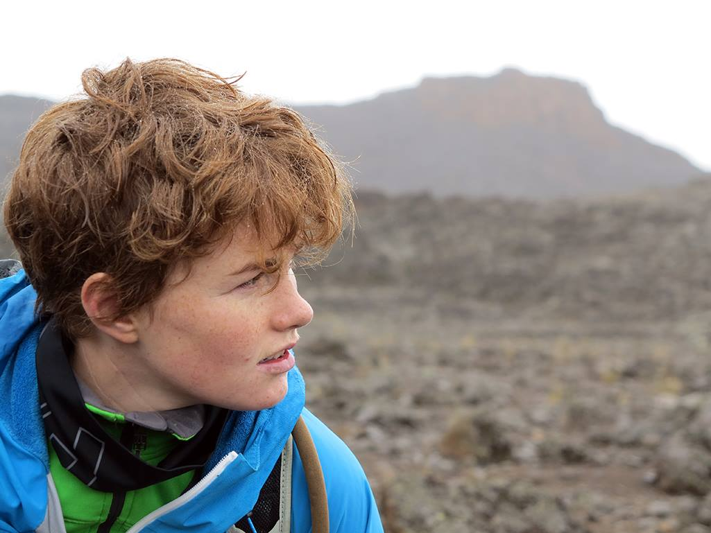

A Scientist in training who loves playing in the mountains and spending hours on my knees and getting my hands dirty attempting to understand the role of microclimates in shaping species interactions. If I'm not too busy gushing about how cute a particular grass (or succulent) is I can probably be found hanging off of the sides of mountains or going on bike-ventures to coffee shops. When the weather forces me indoors I'm usually playing around with the idea of becoming a scientific illustrator. 

