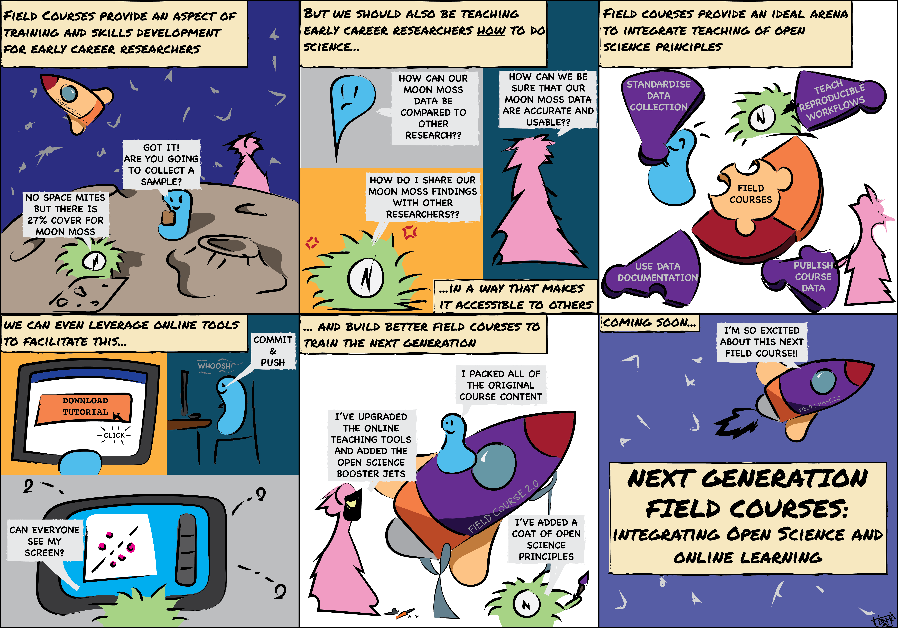
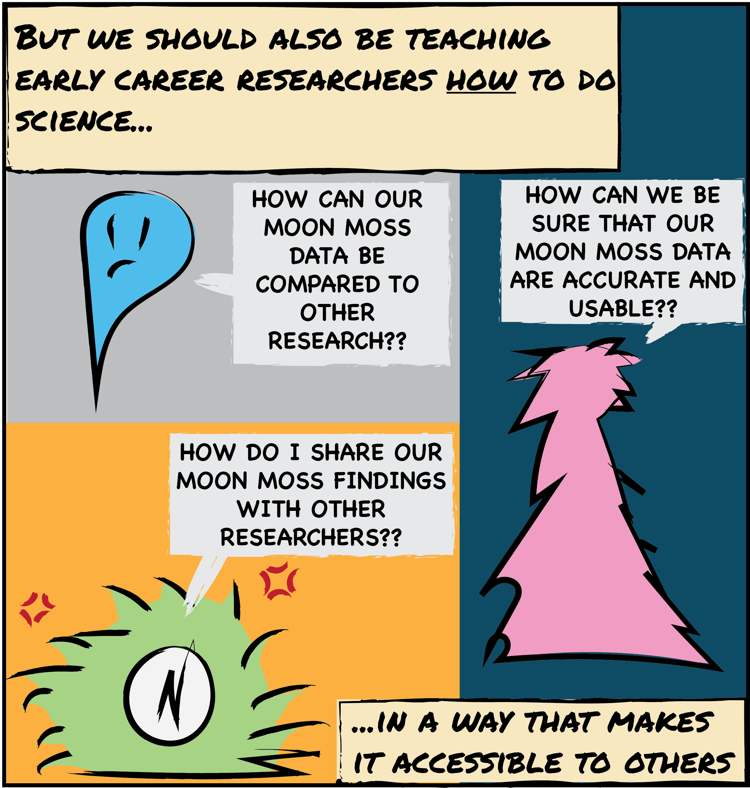

```{r setup, include=FALSE}
knitr::opts_chunk$set(echo = TRUE, eval = FALSE, collapse = TRUE, comment = ">")
options(htmltools.dir.version = FALSE)
htmltools::tagList(rmarkdown::html_dependency_font_awesome())
```

class: center, middle

Presentation created using **{xaringan}** (the **robot** theme)

Slides available at [mkearney.github.io/dsa_execweek_talk/](https://mkearney.github.io/dsa_execweek_talk/)

---

# The Backstory

.center[species interaction networks 🕸 + fancy maths 🧮 | FAIR & Open Science ⚖️ | part-time doodler 🎨 | warm beverage fan ☕]

--
.center[
<br>
Participant of the 5th [Plant Functional Traits Course](https://plantfunctionaltraitscourses.w.uib.no/)

Placed a lot of focus on doing reproducible science

<br>
Inspired [this](https://doi.org/10.1002/ece3.7009) manuscript on how we can incorporate

teaching FAIR and Open Science in 
student training
]

--

<span style="margin: 0;
  position: absolute;
  top: 31%;
  left: 15%;">
  </span>
  
--

<span style="margin: 0;
  position: absolute;
  top: 31%;
  left: 27%;">
  </span>

---

# What is Open Science?

.center[*A global movement to promote integrity, repeatability, and transparency across all aspects of scientific research*]

--

.pull-left[
**Which includes:**

- Open access to publications

- Open access to data

- Open source code and data handling
]

--

<span style="margin-left:-47%; position: absolute; top: 63%"></span>

---

# Make your Science FAIR

.center[***F**indable, **A**ccessible, **I**nteroperable and **R**eproducible*]

---

# Where to Start Though?

.footnote[[*] Respecting data sharing restrictions and embargoes]

.left-column[data lifecycle.png]

.right-column[
- Think about how you enter your data
  * Follow data and metadata standards (e.g. [DarwinCore](https://www.tdwg.org/))
  * Document it (e.g. README file) think of this as an extensive methods section


- Document data processing and analysis
  * Use code-based workflows
  * Annotate said code
  
  
- Archive data in an accessible way
  * Make as open and findable as possible<sup>*</sup> e.g. a data statement and link to archive/repository
  * Use non-propriety file formats e.g. .csv/.txt
  * Include **all** documentation
  
  
- Do some of your own research
]

---
class: inverse, middle, center

background-image: url(https://d33wubrfki0l68.cloudfront.net/62bcc8535a06077094ca3c29c383e37ad7334311/a263f/assets/img/logo.svg)
background-position: bottom
background-size: 20%

# 1. Scripting changes

---
background-image: url(https://d33wubrfki0l68.cloudfront.net/62bcc8535a06077094ca3c29c383e37ad7334311/a263f/assets/img/logo.svg)
background-position: bottom right
background-size: 20%

# Keep it Scripted

Ultimately after inputting your data into a file<sup>*</sup> it should remain untouched and unchanged. 

.footnote[[*] Ideally using a non propriety format such as .csv or .txt]

--

**What does that even mean?**

--

- We want to keep `data_raw.csv` intact and end up with `data_clean.csv` on the other side

--

**Why should I script it?**
--

1. It allows you (and others) to keep track of<br>what you changed

1. Document why you made the changes you<br>did (*sensu lato* a lab book)

1. Avoid the all to common `_cleaned`,<br>`_cleaned2` issue


---
class: inverse, middle, center

background-image: url(https://d33wubrfki0l68.cloudfront.net/62bcc8535a06077094ca3c29c383e37ad7334311/a263f/assets/img/logo.svg)
background-position: bottom
background-size: 20%

# 2. Annotating code

---

# Annotations save lives <sub style="font-size: medium;">(and time)</sub>

Annotating your code by adding comments makes it easier for you (and others) to understand what or why you decided to do what you did

--

.pull-left[
- Pseudocode can double up as annotations
  * Pseudocoding is a way of writing out your code in 'plain language' before you start coding it up
  
  
- Detail specific changes or reasoning
  * Especially when cleaning or transforming data
  ]

---
class: inverse, middle, center

background-image: url(https://d33wubrfki0l68.cloudfront.net/62bcc8535a06077094ca3c29c383e37ad7334311/a263f/assets/img/logo.svg)
background-position: bottom
background-size: 20%

# 3. Data Archiving <sub style="font-size: medium;">(with bonus version control)</sub> 

---

# Get with GitHub

Think of GitHub as a google drive of sorts that you would keep your projects in - the only difference is that it has some bonus features.

* **It's Open Access:** Like a social media profile that people can click on and explore it *i.e.* you can share and showcase your work/packages/projects<sup>*</sup>.
  + This is where your data/analyses can 'live' until needed.

* **It has Version Control:** This means that every time you re-upload a file the older versions are saved (and can be recouped if needed).
  + You can do this [straight from RStudio](https://happygitwithr.com/rstudio-git-github.html)
  + This also facilitates collaboration in a big way (no more email chain!)

* **It's Designed for Programming:** Aside form simple storage of files you can design [workflows](https://docs.github.com/en/free-pro-team@latest/actions/learn-github-actions) that run jobs depending on what happens in the repository.

.footnote[[*] I find this also 'forces' me to make sure my code is readable/shareable]

---

# A GitHub 'Primer'

1. GitHub is the 'norm' in the world of Open Source  - so if you want to go open  go with GitHub

1. [Happy Git and GitHub for the useR](https://happygitwithr.com) is a great starting point if you're interested
  + especially for installing Git on your device (it can be a bit confusing)

1. You can also have private repositories
  * So you can keep your work 'hidden' but still cash in on version control and easier collaborating
  
1. As university students you qualify for a [free pro account](https://education.github.com/pack) - *go for it it*

---

# Other Ways to Open your Science

+ 


