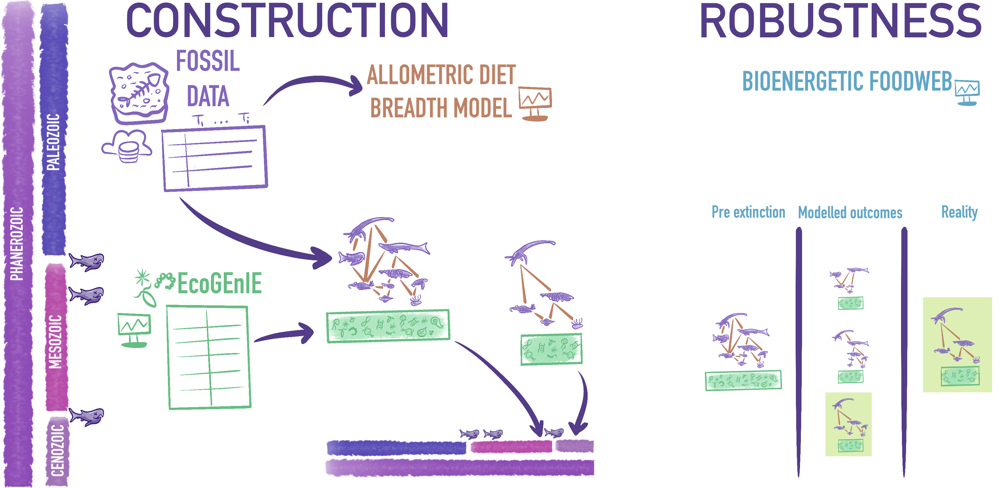

Understanding how ecological networks respond to environmental change requires perspectives that extend beyond contemporary observations. This theme uses paleoecological data and network modeling to reconstruct species interaction networks across deep time, allowing us to explore how networks assemble, persist, and reorganize under long-term environmental dynamics.

As part of my current postdoctoral research, I investigate how large-scale metawebs give rise to realized interaction networks and how hierarchical structure and scale influence extinction risk and system-level resilience. By integrating paleo data with probabilistic network frameworks, this work connects deep-time ecology with predictive network theory.

{width=100%}

## Scaling Paleo Metawebs to Realised Networks

  <a style="text-decoration:none"> Currently active</a>

 

This project applies different approaches to reconstructing species interaction networks across deep time. By treating observed paleo networks as probabilistic realizations of a larger interaction metaweb, this work investigates how long-term environmental change shapes network assembly, persistence, and collapse.

A central goal is to understand how scale, uncertainty, and hierarchical structure influence extinction risk and system-level resilience over evolutionary timescales.

#### Key outputs

* Reconstructing food webs in deep time: why model choice matters for ecological inference (In prep.)

## Network Resilience and Extinction Dynamics Across Time

  <a style="text-decoration:none"> Currently active</a>

 

Building on probabilistic and hierarchical network models, this project examines how network structure mediates species persistence and extinction under long-term environmental change.

By integrating paleo data with predictive network theory, this work links deep-time patterns to contemporary questions about resilience and biodiversity loss.

#### Key outputs

* [No global collapse of marine food webs across the Permian–Triassic Mass Extinction](https://doi.org/10.64898/2026.02.24.707709) (BioRxiv, 2026)

## Bridging Paleo and Contemporary Network Ecology

  <a style="text-decoration:none"> Long-term direction</a>

 

This project explicitly connects paleoecological network reconstructions with modern ecological networks, allowing insights from deep time to inform prediction, uncertainty quantification, and theory in contemporary systems.